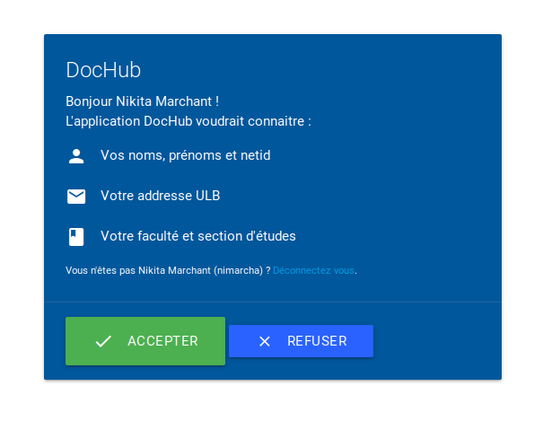

# ULB OAuth

This repository holds the code for a OAuth2 service in front of the ULB intranet.

By trusting this service (and subsequently the ULB "intranet"),
this enables your app to authenticate users with their ULB netid and
gather some information about them (first and last names, email address, faculty, ...)

The (free and open) reference instance is available at *TBD* and a demo consumer using it is available at *TBD*.

# Usage

First, login and create a new application at https://TBD/o/applications/ :
 - Choose `Client type: confidential` and `Authorization grant type: Authorization code`.
 - Fill `Redirect uris` with the url of your app (you can use localhost for dev purposes)

*TDB*

# Installation and deployment

This code is intended to be deployed only once
and be used as much as you want as an open service.

The reference deployment URL will be referenced here when available.

If you still wish to deploy your own (for development or you don't trust us ?),
you may follow the procedure in [INSTALL.md](.meta/INTALL.md)

# License

© Nikita Marchant, Romain Fontaine - 2018

This code is under the [AGPLv3](http://www.gnu.org/licenses/agpl-3.0.html) license.

# Acknowledgement

We make heavy use of [C4ptainCrunch/libnetid](https://github.com/C4ptainCrunch/libnetid).

Thanks to [django-oauth-toolkit](https://github.com/evonove/django-oauth-toolkit) to make it so easy to implement a OAuth2 provider.

Thanks to Django, Materialize.css and Let's Encrypt respectively for a great web framework, easy and pretty css framework and a SSL/TLS certificate (required for OAuth2)
